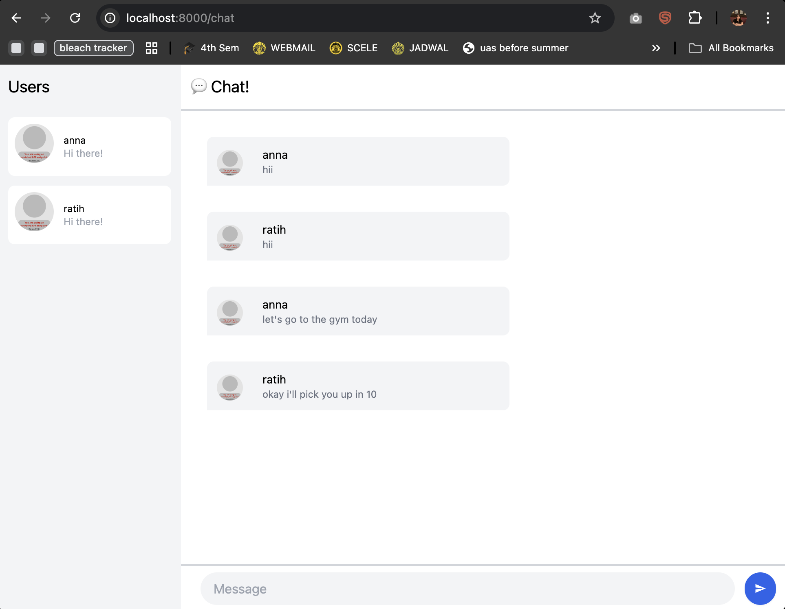
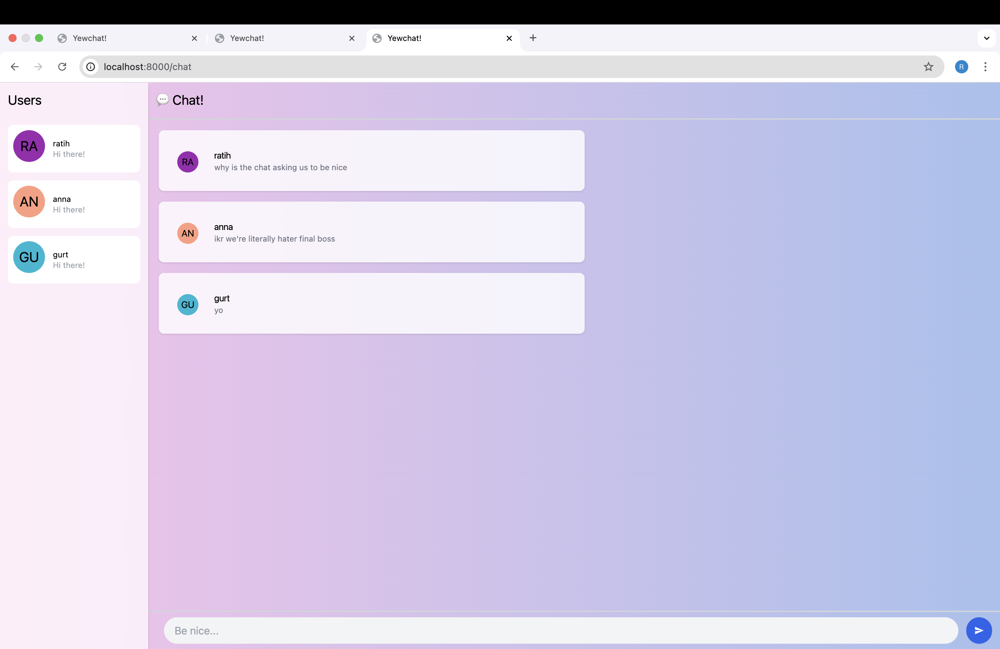

## Kusuma Ratih Hanindyani - 2306256406

### 3.1 Original Code

### 3.2 Add some creativities to the webclient

I redesigned the login page to make it visually engaging and inviting.
I added a soft pink-to-blue gradient background and introduced a welcoming header and subtext with emoji.
The input and button were styled for clarity and contrast, and the interaction was simplified for a better user experience.

I restyled the chat page to visually match the login interface and create a cohesive user experience. 
I applied the same soft gradient background used in the login screen to ensure aesthetic consistency between the two views. 
To modernize the appearance, I added frosted-glass effects to several UI elements such as the sidebar and chat bubbles by using Tailwind classes like `bg-white/70` and `backdrop-blur-md`.
I enhanced the user avatars by integrating ui-avatars.com, which generates avatar images based on each username with randomly colored backgrounds.
I also made improvements to the chat message containers by softening their background with white opacity, rounding the corners, and applying shadows.
Lastly, I updated the message input field with a more welcoming and playful placeholder text: “Be nice...”.